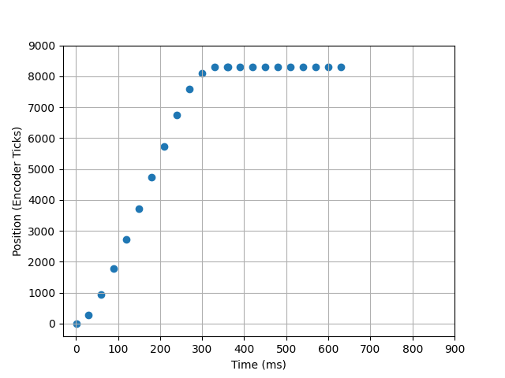

<h1>ME 405 Lab 4</h1>
Scott Frizzell and Jacques Lacroix

This repository contains the classes necessary to run a closed loop, proportional controller for two DC motors simutaniously using a quadrature encoder.

The controller is setup to accept a proportional gain coefficient over serial communication from `desktop.py`, run a step response, then send the data back to `desktop.py` to be plotted.

To run the step response, connect and upload `controller.py`, `encoder_reader.py`, `motor_driver.py`, and `main.py` to a Nucleo board. Run `desktop.py` locally. Clicking the `Run` button will prompt the user to enter a KP value in the terminal window. After pressing enter, the controller will perform two step responses. The data will then be displayed on the plot. Multiple trials may be run and plotted against each other, or all trials can be cleared by clicking `Clear`.

For analysis purposes we only plot the response of one motor to find the slowest rate at which we can run the `main.py` task functions without a significant detriment to performance.

Example (Kp = 0.043) step responses are shown below:

<h3>Fast Rate</h3>
The following step response was performed with a task period of 20ms and a KP value of 0.043

<h3>Critical Rate</h3>
The following step response was performed with a task period of 30m

<h3>Slow Rate</h3>
The following step response was performed with a task period of 40m

From these graphs we determined that 30ms was the optimal task period. 